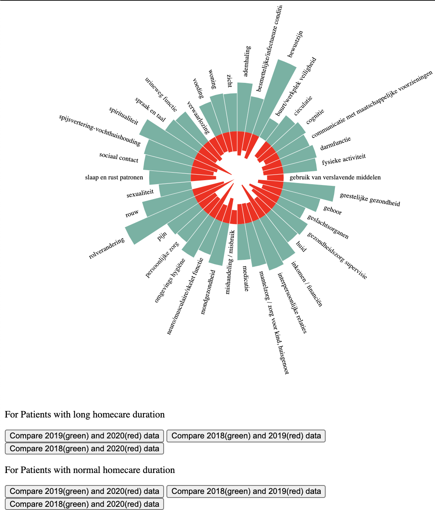

# D3.js with buttons

Plots with selections and buttons to filter.

## Bar plot with selections

Plot with two sections:

## Map plot
- could zoom-in and zoom-out
- click button, dynamically change data sources

## Line plot
Click color indicate in legend to filter out

## Circle Bar plot

